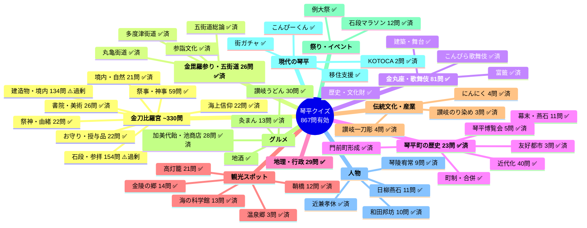

# 琴平クイズ ナレッジマップ

作成日: 2026-04-06
最終更新: 2026-04-07
総問題数: 991問（有効948問 / 無効43問）

---

## ビジュアルマップ

### 凡例
- ✅ 充実（追加不要）
- ✅済 今回のセッションで充実させたテーマ
- ⚠️ 過剰（重複整理が必要）

---

## テーマ別詳細

### 1. 金刀比羅宮（~330問）

#### 1.1 祭神・由緒（22問）✅
- カバー済み: 大物主神、崇徳天皇、創建の歴史、御利益、神仏分離

#### 1.2 石段・参拝（154問）⚠️ 過剰
- 要対応: 重複問題の整理が必要（石段の段数だけで多数の類似問題あり）

#### 1.3 建造物・境内（134問）⚠️ 過剰
- 要対応: 類似問題の整理検討

#### 1.4 書院・美術（26問）✅
- 今回追加: 伊藤若冲「百花図」201種、田窪恭治の白書院ヤブツバキ障壁画、円山応挙90面、高橋由一35点奉納の経緯、三井八郎兵衛の援助

#### 1.5 お守り・授与品（22問）✅

#### 1.6 海上信仰（22問）✅
- 今回追加: 流し樽の風習、金毘羅講の仕組み、こんぴら狗の代参、分社6社、全国約600社

#### 1.7 祭事・神事（59問）✅

#### 1.8 境内・自然（21問）✅
- 今回追加: 象頭山の名勝指定、暖帯林のクス自生北限、メサ地形、桜の品種「コトヒラ」「ヤオトメ」、神馬（光驥号・月琴号）

---

### 2. 金毘羅参り・五街道（26問）✅
- 726-772で大幅に拡充済み（五街道総論、丸亀街道、多度津街道、参詣文化）

---

### 3. 金丸座・歌舞伎（81問）✅
- 今回追加: 朱印地・天領の背景、明かり窓3段階調整、収容約740人、お茶子、近兼孝休の功績、すばらしき仲間のエピソード

---

### 4. 琴平町の歴史（23問）✅
- 今回追加: 門前町形成（天保5年の打毀）、琴平博覧会（高橋由一）、友好都市（出雲市）

---

### 5. 地理・行政（29問）✅

---

### 6. 観光スポット

#### 6.1 高灯籠（21問）✅
#### 6.2 鞘橋（12問）✅ — 726-772で新規作成済み
#### 6.3 金陵の郷（14問）✅
#### 6.4 海の科学館（13問）✅ — 今回追加（しんかい6500、弁財船、操船シミュレーター）
#### 6.5 こんぴら温泉郷（3問）✅ — 今回追加（1997年掘削、泉質）

---

### 7. 伝統文化・産業
#### 7.1 讃岐一刀彫（4問）✅ — 726-772で新規作成済み
#### 7.2 讃岐のり染め（3問）✅ — 726-772で新規作成済み
#### 7.3 にんにく（4問）✅ — 今回新規作成

---

### 8. グルメ・名産品
#### 8.1 讃岐うどん（30問）✅
#### 8.2 灸まん（13問）✅ — 今回追加（和田邦坊デザイン、こんぴら春団子）
#### 8.3 加美代飴・池商店（28問）✅ — 今回追加（創業1245年、五人百姓の由来、5家の家名、原材料、扇型の経緯）
#### 8.4 地酒（金陵）✅

---

### 9. 祭り・イベント
#### 9.1 例大祭 ✅
#### 9.2 石段マラソン（12問）✅ — 726-772で新規作成済み

---

### 10. 現代の琴平
#### 10.1 街ガチャ ✅
#### 10.2 こんぴーくん ✅
#### 10.3 KOTOCA（2問）✅ — 今回新規作成
#### 10.4 移住支援 ✅

---

### 11. 人物
#### 11.1 日柳燕石（11問）✅
#### 11.2 琴陵宥常（9問）✅ — 今回新規作成（ノルマントン号事件、水難救済会創設、黒田清隆への直訴）
#### 11.3 和田邦坊（10問）✅ — 今回新規作成（生涯、パッケージデザイン、映画化、うどん本陣山田家）
#### 11.4 近兼孝休 ✅ — 今回新規作成（歌舞伎復活、温泉掘削）
#### 11.5 中村光一 — 丸亀市出身と判明し対象外

---

## 今回追加されたテーマ（849-882）

### 石段かご（5問）✅
- 石段かごとは何か、運行区間（352段目まで）、2020年廃止、料金、代替手段

### 金毘羅船々（8問）✅
- 曲の種類（香川県の民謡）、歌詞の意味、お座敷遊びのルール、こんぴら船の就航年、みんなのうた

### 文化遺産オンライン関連（20問）✅
- 金毘羅庶民信仰資料（1,725点、燈篭668基）
- 琴平町の大センダン（樹齢約300年、天然記念物）
- 丸尾醸造所（登録有形文化財、黒漆喰の虫籠窓）
- へんこつ屋店舗（網代組のヴォールト状天井）
- こんぴらうどん参道店（旧櫻屋旅館）
- 金刀比羅宮宝物館、重文建造物
- JR琴平駅（跨線橋が県内最古級、陳列所）
- 琴平町公会堂

---

## クイズ設計思想

### 目的

琴平クイズの目的は検定試験ではなく、**琴平町への興味を育てて知識を定着させること**である。
- 4択形式に絞っているのは「わからなくても選べる → 解説で学ぶ」体験を成立させるため
- 正解は常に1つ、明確に正しい。「最も適切な答え」のような曖昧な判断は求めない
- 知らなかった → 知った → 覚えた、というサイクルを回すことが最優先

詳細なリサーチは以下を参照:
- `docs/draft/quiz_design_research.md` — 択一クイズ設計の理論・ベストプラクティス
- `docs/draft/gotochi_quiz_research.md` — ご当地検定の事例・フレームワーク

### 認知レベル（ブルーム・タキソノミー）

琴平クイズでは**記憶・理解を中心（70%以上）**とする。

| 認知レベル | 説明 | 琴平クイズでの位置づけ | 目標比率 |
|-----------|------|----------------------|---------|
| **記憶** | 事実・用語の想起 | **主力** — 基礎知識の定着 | 35-45% |
| **理解** | 意味の解釈・説明 | **主力** — 概念・背景の理解 | 30-40% |
| **分析（理由型のみ）** | 因果関係の把握 | **補助** — 「へぇ」感と深い理解 | 5-10% |
| 応用・評価 | 新場面への適用・判断 | アクセント程度 | 5%以下 |

### 出題パターンの方針

#### 主力パターン（全体の80%以上）

| # | パターン | 認知レベル | 例 | 面白さ |
|---|---------|-----------|---|--------|
| 1 | **事実想起** | 記憶 | 「石段は何段?」「創業年は?」 | 知識が増える実感 |
| 2 | **定義・説明** | 記憶-理解 | 「五人百姓とは何か?」「石段かごとは?」 | 概念を知る面白さ |
| 3 | **分類** | 理解 | 「五街道に含まれないのは?」 | 知識の整理 |
| 4 | **概念説明** | 理解 | 「金毘羅信仰が海と結びついた背景は?」 | 深い理解 |

#### 積極的に増やすパターン

| # | パターン | 認知レベル | 例 | 面白さ |
|---|---------|-----------|---|--------|
| 6 | **因果・理由** | 分析 | 「なぜ加美代飴は扇型に変わった?」 | **「へぇ」感が最も高い** |

理由型は現状12問（1.4%）と極端に不足。情報ギャップ理論に基づき、「なぜ?」→答えで好奇心が満たされる快感が最も強い出題パターン。**40問以上（5-10%）を目標**に拡充する。

#### アクセント程度（少数でよい）

| # | パターン | 例 | 備考 |
|---|---------|---|------|
| 5 | 比較 | 「本宮と奥社の祭神の違いは?」 | 上級者向け |
| 7 | 応用 | 「2時間で奥社まで往復できるか?」 | 実用的だが少数 |
| 8 | 手順・順序 | 「参道で最初に通る建造物は?」 | 体験と紐づく |
| 9-10 | 最善判断・予測 | — | 基本的に不採用 |

### 現状分析（有効850問）

#### 出題パターン別

| パターン | 問題数 | 割合 | 評価 |
|----------|--------|------|------|
| 時期型「いつ/何年」 | 172問 | 20.2% | ⚠️ 過多（増やさない） |
| 定義型「○○とは何か」 | 129問 | 15.2% | △ 固有名詞当てに偏り（概念型を追加） |
| 数量型「いくつ」 | 75問 | 8.8% | ✅ |
| 選択型「どれ」 | 75問 | 8.8% | ✅ |
| 場所型「どこ」 | 72問 | 8.5% | ✅ |
| 特徴型「どのような」 | 67問 | 7.9% | ✅ |
| 人物型「誰」 | 53問 | 6.2% | ✅ |
| 料金型「いくら」 | 24問 | 2.8% | ✅ |
| **理由型「なぜ」** | **12問** | **1.4%** | **🔴 極端に不足 → 40問以上へ** |
| その他 | 171問 | 20.1% | — |

#### 難易度別

| 難易度 | 問題数 | 割合 | 推奨 | 評価 |
|--------|--------|------|------|------|
| easy | 174問 | 19.7% | 25-30% | 🔴 不足（50-90問追加） |
| medium | 401問 | 45.5% | 40-50% | ✅ 適正 |
| hard | 307問 | 34.8% | 25-30% | ⚠️ やや過剰 |

### 選択肢の品質基準

- 正解は1つ、明確に正しい（曖昧な判断は求めない）
- 4つの選択肢は**同カテゴリ・同粒度**にする（人名なら全て人名、数字なら全て数字）
- **正解だけ明らかに詳しい**問題は修正対象（単位の違い、刻みの違い等に注意）
- **選択肢の文字数は4つとも同程度に揃える**（最長/最短の比率1.3倍以内が目安。正解が最長にならないよう、不正解にも具体的なディテールを加える）
- ディストラクターは「よくある誤解」に基づく（もっともらしい具体性を持たせる。短くて雑な選択肢はNG）
- 「すべて正しい」「正しいものはない」は使わない

### 問題作成の指針

1. 新テーマは **定義型 → 理由型 → 概念説明 → 事実想起** の順で作成
2. 時期型・数量型は既に十分なので意識的に抑える
3. **理由型を意識的に増やす**（各テーマに最低1問の「なぜ」）
4. 1テーマにつき複数パターンで問い、学習効果を高める
5. easy問題を意識的に増やす（観光客向けの入口）
6. 解説はSEEEDフレームワーク（Source/Essence/Episode/Expansion/Discovery）で質を高める
7. 選択肢は正解と同粒度に揃え、正解だけ目立たないようにする
8. **文体は敬体（ですます調）で統一**。質問文末尾は「〜ですか？」。選択肢内は体言止め or 常体で4択を揃える
9. **選択肢の文字数を揃える**（不正解にも具体的な人名・年代・理由を入れて正解と同程度の長さにする。最長/最短1.3倍以内）

### レビュー時のチェックリスト

- [ ] 正解が明確に1つであること
- [ ] 選択肢が同カテゴリ・同粒度であること
- [ ] **選択肢の文字数が揃っていること**（正解だけ突出して長くないか）
- [ ] **文体が統一されていること**（質問文＝敬体、選択肢内＝体言止め/常体で統一）
- [ ] 出典がTier 1ソースで裏取りされていること
- [ ] 既存問題と重複していないこと
- [ ] 解説に出典URLが含まれていること

---

## 残課題

### 🔴 理由型・基礎知識・easy問題の拡充
- 理由型: 12問 → 40問以上（各テーマに「なぜ」を追加）
- 定義型: 概念・仕組みを問う基礎知識を追加（固有名詞当てではなく）
- easy: 50-90問追加（現状19.7% → 目標25-30%）

### 🟡 選択肢の品質レビュー
- 正解だけ明らかに詳しい・単位や刻みが違う問題を洗い出して修正

### ⚠️ 重複整理（完了）
- 完全重複4問を無効化済み（528, 529, 565, 566）
- パターン重複（同形式で別対象）は問題として有効なため残置

### Wikipedia単独出典の改善
- 167問がWikipedia単独出典のまま（公式サイトに該当情報がなく置換できなかったもの）
- 個別のTier 1ソース調査が必要

### 内容矛盾の確認
- kotohira_450, 466（車での参拝不可）が金刀比羅宮公式の「お車参拝予約」と矛盾の可能性

### 未レビュー残り
- 散在の保留8問（503, 514, 526, 535, 639, 645, 679, 682）

### URL出典なし
- 有効問題のうち71問がURL出典未付与（個別店舗・ローカルイベント系）
